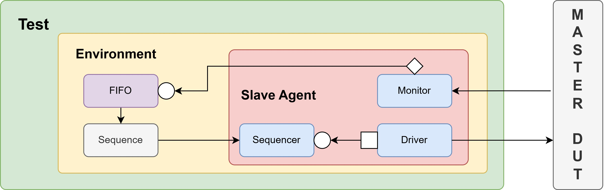
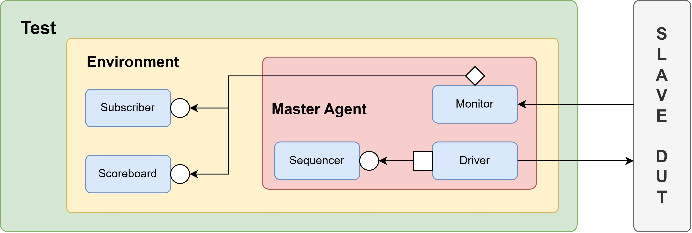

# 📘 APB UVM VIP Description

## 🧩 Module Overview

This project implements a configurable and reusable APB (Advanced Peripheral Bus) UVM Verification IP based on the AMBA® APB protocol specification (IHI 0024E).  
It supports three modes of operation — **master VIP**, **slave VIP**, and **loopback testbench** — through flexible configuration.

The VIP includes layered base components, driver/monitor/sequencer agents, protocol timing assertions (SystemVerilog Assertions), optional bus functional models (BFMs), and reference model support.  
It is designed to validate both master and slave DUTs by instantiating the corresponding passive or active agent, and can be used for directed or random stimulus generation.

### Supported Features

- APB master transactions: read/write stimulus generation
- APB slave response handling: data return and memory emulation
- Configurable setup and access phase timing
- Loopback test support between master and slave agents
- Built-in SystemVerilog Assertions (SVA) for protocol timing checks
- UVM scoreboard and passive agent monitoring support
- Functional coverage for read/write address, data, and control signals
- Optional BFMs for standalone integration without UVM

---

## 🔧 I/O Signals

| Signal     | Direction | Width        | Description                           |
|------------|-----------|--------------|---------------------------------------|
| `PCLK`     | Input     | 1            | APB clock                             |
| `PRESETn`  | Input     | 1            | Active-low reset                      |
| `PSEL`     | Input     | 1            | Peripheral select                     |
| `PENABLE`  | Input     | 1            | Enable for access phase               |
| `PADDR`    | Input     | Configurable | Address bus                           |
| `PWRITE`   | Input     | 1            | Write enable                          |
| `PWDATA`   | Input     | Configurable | Write data bus                        |
| `PRDATA`   | Output    | Configurable | Read data bus                         |
| `PREADY`   | Output    | 1            | Ready signal                          |

---

## 🔁 APB Protocol Behavior

- **Setup Phase**:
  - Master asserts `PSEL` with valid `PADDR`, `PWRITE`, `PWDATA` (for write) on the rising edge of `PCLK`.

- **Access Phase**:
  - Master asserts `PENABLE` while keeping `PSEL` high.
  - Slave responds with `PREADY` and provides `PRDATA` for read operations.

- **Timing Control**:
  - Single setup and access phase; no burst support.
  - Ready signal may insert wait states.

---

## 📷 APB Block Diagram

### Loopback Test


### Master VIP Test


### Slave VIP Test


---

## 📁 Directory Structure
```
PKHUANG_APB_VIP/
├── bfm/
│   └── apb_slave_bfm.sv
│
├── seq/
│   └── apb_mater_seq.sv
│
├── test/
│   └── apb_basic_rw_test.sv
│
├── top/
│   └── sim_top.sv
│
├── vip/
│   ├── base/
│   │   ├── apb_agent_base.sv
│   │   ├── apb_driver_base.sv
│   │   └── apb_monitor_base.sv
│   │
│   ├── common/
│   │   ├── apb_coverage.sv
│   │   ├── apb_define.svh
│   │   ├── apb_env.sv
│   │   ├── apb_package.svh
│   │   ├── apb_scoreboard.sv
│   │   └── apb_seq_item.sv
│   │
│   ├── interface/
│   │   └── apb_interface.sv
│   │
│   ├── master/
│   │   ├── apb_master_agent.sv
│   │   ├── apb_master_driver.sv
│   │   └── apb_master_monitor.sv
│   │
│   ├── slave/
│   │   ├── apb_slave_agent.sv
│   │   ├── apb_slave_driver.sv
│   │   └── apb_slave_monitor.sv
│   │
│   └── sva/
│       ├── apb_protocol_sva.sv
│       └── bind_apb_protocol_sva.sv
│
└── README.md
```